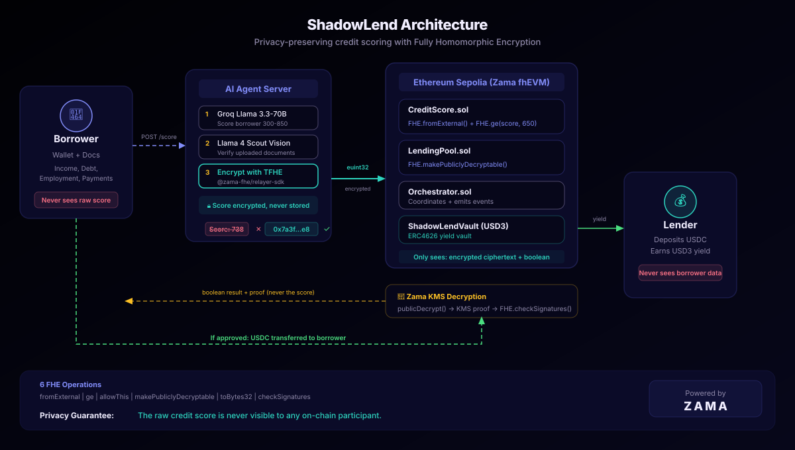

# ShadowLend: private credit scoring for undercollateralized lending

Borrow without collateral. Your credit score is encrypted on-chain with TFHE; the contract checks it without ever decrypting it. Built on Zama fhEVM and Groq AI.

[](https://soliditylang.org/)
[](https://react.dev/)
[](https://www.zama.org/)
[](https://groq.com/)
[](LICENSE)
[]()
[](https://www.zama.org/)



---

## Try it live

**[Launch ShadowLend](https://shadowlend-cyan.vercel.app)** (Sepolia testnet)

1. Connect MetaMask on Sepolia.
2. The faucet drops 1,000 test USDC to your wallet automatically.
3. Fill in your financial data and upload a supporting document (bank statement, pay stub).
4. Click **Submit for Encrypted Scoring**. Groq AI scores you, encrypts the result with TFHE, and submits it on-chain.
5. If eligible, pick an amount and borrow. The contract checks your encrypted score homomorphically and transfers USDC.
6. Visit the **Supply** page to deposit USDC as a lender and earn USD3 vault tokens.

No real funds. Everything runs on Ethereum Sepolia.

---

## What it does

ShadowLend gives people loans based on creditworthiness, not collateral. An AI agent scores your financial data off-chain, encrypts the result with TFHE, and submits it to the contract. The contract checks `score >= 650` without decrypting it. Nobody sees your score: not the lender, not the blockchain, not the UI.

Loan terms (how much you can borrow, what rate you pay) are computed entirely in FHE space. The contract runs FHE arithmetic on your encrypted score before your wallet ever sees the result.

---

## Features

- **Encrypted credit scoring.** Score is encrypted with Zama TFHE before it touches the chain. The contract runs `FHE.ge()` on ciphertext.
- **FHE-computed loan terms.** Max borrow and interest rate are calculated with `FHE.add`, `FHE.mul`, `FHE.sub`, `FHE.min` on the encrypted score. Score 650 gets $1,000 at 8% APR. Score 850 gets $10,000 at 2% APR.
- **On-chain reputation flywheel.** Every full repayment adds +25 points to your effective score (capped at 850). The repayment count is plaintext on-chain; the bonus is applied via `FHE.add` inside the encrypted computation.
- **AI underwriting.** Groq Llama 3.3-70B scores your financial signals. Llama 4 Scout vision cross-checks uploaded documents against what you stated. Contradictions reduce your score.
- **On-chain signal weighting.** Wallet age, ETH balance tier, DeFi interaction count, and ShadowLend repayment history are fetched from Alchemy and weighted at 40% of the total score. These can't be faked.
- **Fraud pre-filter.** OFAC sanctions check, active loan block, and fresh wallet detection. Wallets under 30 days old are capped at 550.
- **Self-relaying decryption.** No oracle. `FHE.makePubliclyDecryptable()` + KMS-signed proofs via `FHE.checkSignatures()`.
- **Selective regulatory disclosure.** A 2-of-3 compliance committee must vote before a regulator gets decrypt access. Committee members are elected by DAO multisig (Gnosis Safe) with a 30-day timelock on membership changes. The protocol can't trigger this unilaterally, and neither can any single person.
- **AI chat assistant.** Ask anything about your score, loan terms, or how FHE works. Context-aware when your wallet is connected.
- **ERC4626 yield vault.** Lenders deposit USDC and receive USD3 tokens. Yield comes from borrower repayments.

---

## Tech stack

| Layer | Technology |
|-------|-----------|
| Confidential contracts | Zama fhEVM v0.9+ on Ethereum Sepolia |
| AI credit scoring | Groq API (Llama 3.3-70B + Llama 4 Scout vision) |
| Encryption SDK | @zama-fhe/relayer-sdk (TFHE 32-bit) |
| Frontend | React 18 + Vite + Tailwind CSS + ethers.js v6 |
| Vault | ERC4626 (ShadowLend USD3) |
| Token | MockUSDC (ERC20, 6 decimals) |

---

## Smart contracts (Ethereum Sepolia)

| Contract | Address | Purpose | FHE operations |
|----------|---------|---------|----------------|
| [CreditScore](https://sepolia.etherscan.io/address/0xA81619b5d6460EEf3b9BAC0928F131bbE8d610AA) | `0xA816...10AA` | Encrypted score storage, loan term computation, repayment reputation, compliance gate | `fromExternal`, `ge`, `add`, `mul`, `sub`, `min`, `max`, `asEuint32`, `allowThis`, `allow` |
| [LendingPool](https://sepolia.etherscan.io/address/0xA296833b01C704EdAd3078CD772d0F29855d9Fc3) | `0xA296...9Fc3` | Loan lifecycle, decryption marking, proof verification | `makePubliclyDecryptable`, `checkSignatures`, `toBytes32` |
| [Orchestrator](https://sepolia.etherscan.io/address/0x2411B413617c515Ff8aB4bFF73D7BAF3Ef46BEAf) | `0x2411...EAf` | Coordinates contracts, manages scorer roles | None (coordinator) |
| [ShadowLendVault](https://sepolia.etherscan.io/address/0xe59ADc5a116c519dA0D9C6E912c595e06B3e1F4c) | `0xe59A...1F4c` | ERC4626 yield vault for lenders | None |
| [MockUSDC](https://sepolia.etherscan.io/address/0x787a9d23cfeCAD22c54605Ffb55eb46cC2E779F5) | `0x787a...79F5` | Test USDC token | None |

FHE transactions on-chain:
- [submitScore (encrypted credit score)](https://sepolia.etherscan.io/tx/0x1b9cc5287f4d64f659e6e0ed56401cb27f10bfc1f276ce5317dfbcef839121c0)
- [requestLoan (homomorphic threshold check)](https://sepolia.etherscan.io/tx/0xad93555036d311291ea6fd74f4b96468d977f49447aacae0de19898a849993df)
- [repayLoan](https://sepolia.etherscan.io/tx/0xc520b20180423defe8901827f40acac851dfc56177e1c5f5cb22f4cbdb7dda14)

---

## Architecture

```
Borrower (Browser)          Agent Server            Ethereum Sepolia (Zama fhEVM)
                                 |
  1. Fill form + upload docs     |
  2. Connect wallet              |
        |                        |
        |-- POST /score -------->|
        |   (signals + docs)     |
        |                   3. Fetch on-chain signals (Alchemy)
        |                   4. OFAC + fraud pre-filter
        |                   5. Groq AI scores (Llama 3.3-70B)
        |                   6. Vision doc analysis (Llama 4 Scout)
        |                   7. Encrypt via relayer SDK (TFHE)
        |                        |
        |                        |-- submitScore() ----------> CreditScore.sol
        |                        |   (encrypted euint32)        FHE.fromExternal()
        |<-- { txHash } --------|
        |
  8. requestLoan() ----------------------------------> Orchestrator -> LendingPool
        |                                               FHE.ge(score, 650)
        |                                               FHE.add/mul/sub/min (loan terms)
        |                                               FHE.makePubliclyDecryptable()
        |
  9. publicDecrypt() <-- Zama KMS --------------------|
        |  (decrypts boolean + terms, returns proofs)
        |
 10. finalizeLoan(proofs) -------------------------> FHE.checkSignatures() x3
        |                                               if eligible: USDC transfer
        |<-- LoanApproved event -----------------------|
        |
 11. repayLoan() ----------------------------------> principal + FHE-computed fee
        |                                               creditScore.incrementRepaymentCount()
```

---

## Privacy model

| Data | Borrower | Agent | Blockchain | Lender |
|------|----------|-------|------------|--------|
| Financial signals | Sees | Sees | Never | Never |
| Raw credit score | Never | Ephemeral only | Never | Never |
| Encrypted score | No | Submits it | euint32 ciphertext | No |
| Loan terms (amount, rate) | Result only | No | Computed in FHE | No |
| Eligibility (bool) | Event result | No | Decrypted by KMS | Event result |
| Loan amount | Yes | No | Public | Yes |

No single party has the full picture. The agent sees your financial data but not the on-chain state. The contract sees encrypted ciphertexts but not the values. Lenders see aggregate pool performance, not individual scores.

---

## Compliance model

By default, your encrypted score is inaccessible to everyone, including regulators. The compliance system exists to satisfy legitimate legal obligations without creating a permanent backdoor.

When a regulator flags a borrower, they contact the compliance committee. Two of the three members must independently call `requestComplianceDecryption(borrower)` on-chain. Only after that second vote does the contract call `FHE.allow(score, complianceOfficer)`, granting decrypt access to the designated address.

Committee members are elected by DAO multisig (Gnosis Safe) with a 30-day timelock on any membership change. That means if someone tries to swap in a compliant address to manufacture access, the attempt is visible on-chain for 30 days before it takes effect. Every vote emits `ComplianceSignatureAdded`. Access grants emit `ComplianceAccessGranted`. The full audit trail is on-chain.

The borrower can't block a legitimate 2-of-3 vote. The protocol admin can't trigger it alone. That's the point.

---

## Running locally

```bash
git clone https://github.com/ajanaku1/ShadowLend.git
cd ShadowLend

# Install dependencies
npm install

# Set up environment
cp .env.example .env
# Fill in: GROQ_API_KEY, SCORER_PRIVATE_KEY, CREDIT_SCORE_ADDRESS, SEPOLIA_RPC_URL

# Start agent server (port 8080)
npm run agent

# Start frontend (port 5173, proxies /api to agent)
npm run dev:frontend
```

---

## Project structure

```
ShadowLend/
  contracts/
    CreditScore.sol             # Encrypted score storage, FHE loan term computation, compliance gate
    LendingPool.sol             # Loan lifecycle, proof verification
    ShadowLendOrchestrator.sol  # Contract coordinator
    ShadowLendVault.sol         # ERC4626 lender vault (USD3)
    MockUSDC.sol                # Test token
  agent/
    server.js                   # Scoring, encryption, faucet, chat endpoints
  frontend/
    src/
      App.jsx                   # Main app + wallet connection
      Landing.jsx               # Homepage
      Profile.jsx               # Borrower dashboard + compliance panel
      Supply.jsx                # Lender vault interface
      components/
        BorrowerForm.jsx
        LoanCard.jsx
        RepayCard.jsx
        Navbar.jsx
        ChatAgent.jsx           # AI chat assistant widget
      config/                   # Constants, ABIs
  test/                         # 53 passing tests (unit + integration + vault)
  scripts/
    deploy.js
    demo.js
```

---

## License

MIT
